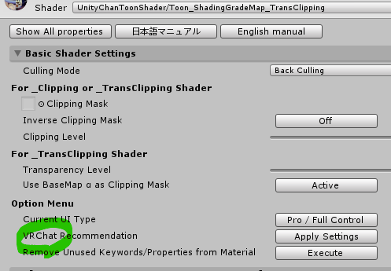
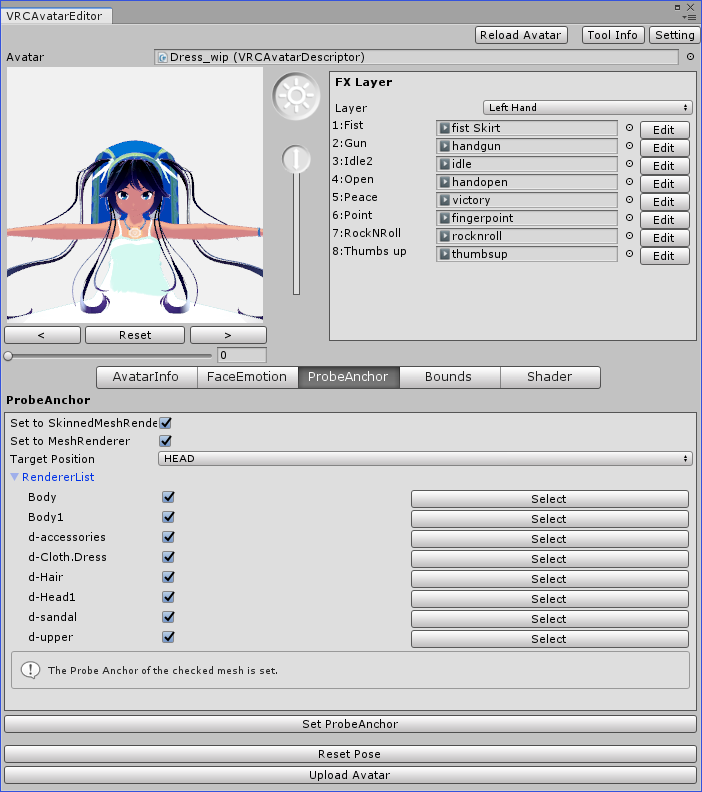
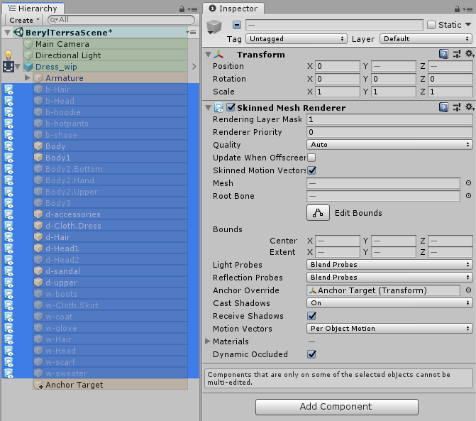
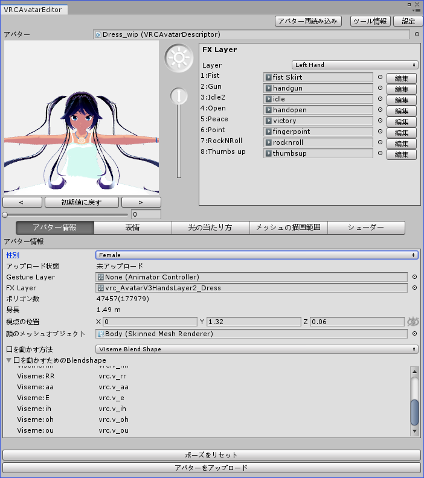
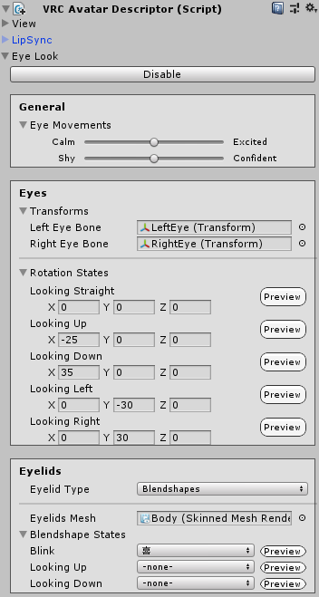

 最初の準備  
===========  
* Unityプロジェクト  
  * VRChat SDKを入れる  
  * Dynamic Boneを入れる  
  * Unity-chan Toon Shader(UTS) を入れる  
* アバターの unitypackage をインポート  
* prefab を scene にドラッグアンドドロップ  

 改変じゃないけどAvatar3.0のための作業  
===================================== 
* Avatar2.0→3.0変換  
  * [VRCAvatars3Tools](https://booth.pm/ja/items/2207020)(VRCAvatars3Tools_20200819.unitypackage) をインポート  
  * アバターを指定して、変換実行  
    * アバター名_3.0が出来上がるので、古いほうをシーンから削除  
    * VRChatSDK2.0用のAvatarDescriptorがMissingで残ったままになっているので、アバター名_3.0から削除  
* 表情確認ツール  
  * [VRCAvatarEditor beta](https://booth.pm/ja/items/1258744)(VRCAvatarEditor_v0.6.unitypackage)をインポート  

 unity環境整理  
===============  
* 階層色付け  
  * [VRCHierarchyHighlighter](https://booth.pm/ja/items/1326573)(VRCHierarchyHighlighter_v2020.08.17.0.unitypackage)をインポート  
  * これを入れるとMenuSimplifierがエラーになるっぽい。ただし、VRCHierarchyHighlighterをメニュー位置移動させなければOKっぽい  
* unity メニュー整理  
  * [MenuSimplifier](https://booth.pm/ja/items/2120490)(MenuSimplifier_v1_0.unitypackage) をインポート  
  * これを使ってメニューを整理  
    * 拡張機能を追加するごと（メニューが増えるごと）に実行して整理する  

 設定していく  
=============  

 アバター一般設定  
------------------  
* 光らないようにするため、__UTS設定__ 変更  
    
  * 使用しているマテリアルすべてに対して設定を行う  
* 明るさの差が出ないようにするため、  __Anchor Override__ を設定  
  * VRCAvatarEditorにProbeAnchorタブがあり、表示onになっているメッシュに対して一括で設定できる  
      
  * 後から表示onにしても平気なように、表示offになっているメッシュにも同じAnchorTargetを指定しておく  
    
* 性別を __Femail__ に変更  
    
* アバターサイズ抑止のため、表示offのメッシュのTagを __EditorOnly__ に変更  
* __Eye Look__ の設定  
  * アバターの実装に依存する  
    * ボーンの構造  
    * 目の向きや確度  
      * この見た目がアバターの個性となる
  * 設定する内容  
      
    * Hierarchy 上のアバターを選択して、VRC Avatar Descriptorを表示させ、「Eye Look」を Enable にする。  
    * Eyes の設定
      * Transformsで目のボーンを選択する（Beryl-Terrsaちゃんの場合は最初から選択される）
      * Rotation Statesで、
        * 直視=(0,0,)
        * 上に目をそらす = (-x,0,0)
        * 下に目をそらす = ( x,0,0)
        * 左に目をそらす = (0,-y,0)
        * 右に目をそらす = (0, y,0)  
        のように、それぞれ設定する。（+xと-xとすると、上下で移動量が同じになります。+yと-yとすると、左右で移動量が同じになります。xとyの値はアバターによって決める）
    * Eyelids の設定  
      Eyelidsとはまぶたのこと  
      * Eyeid Types は Blendshapes を選択する。
      * Eyelids Mesh は Body(Skinned Mesh Renderer) を選択する
      * Blendshape Status の設定
        * Bllink は、目を閉じたブレンドシェイプを選択する
        * Looking Up は、顔を上げたときに発動させるブレンドシェイプを選択する。-none-を選択すると顔を上げても発動しない。
        * Looking Down は、顔を下げたときに発動させるブレンドシェイプを選択する。-none-を選択すると顔を上げても発動しない。
