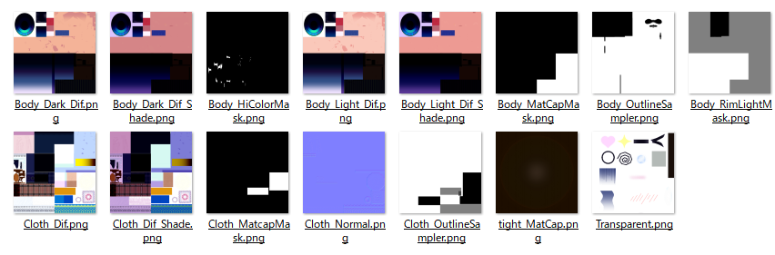

 Beryl Terrsa ちゃんのテクスチャ画像への書き込み  
=================================================  

* テルサちゃんで使われているテクスチャ画像ファイル  
  * テルサちゃんのテクスチャ画像は、下記の画像が用意されています。 __自分で描きこんだ物をそれぞれの画像に反映（描き込み）__ しましょう。  
      
    * とくに、肌・髪・瞳の画像は4枚あります。  
      * 通常肌＋影、日焼け肌＋影の4枚です。  
    * 服装の画像は2枚あります。通常服装＋影の2枚です。  

* テクスチャ画像への描き込み  
  * 例えば、紅を注す（口紅を塗る）とすると、4枚の画像を用意しないとダメ。  
  * なので、 __自分の描き込みをレイヤーで描き込み__ 、4枚の画像にする。  
    * 1枚目元画像(Body_Dark_Dif.png)をレイヤーとして取り込む。  
    * 新しいレイヤーを作って紅を注す。  
    * この２つのレイヤーを表示した状態のpng画像を書きだす。  
    * この口紅 __レイヤーをコピーして、2枚目～4枚目の画像を作る。__  
